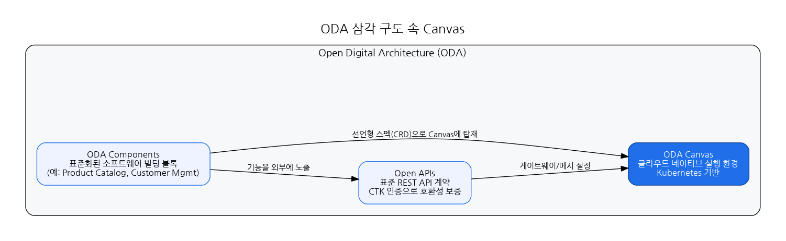
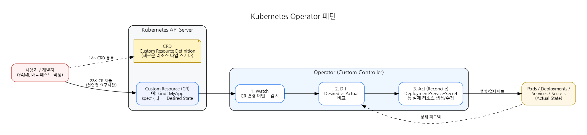
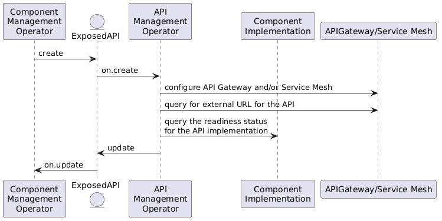
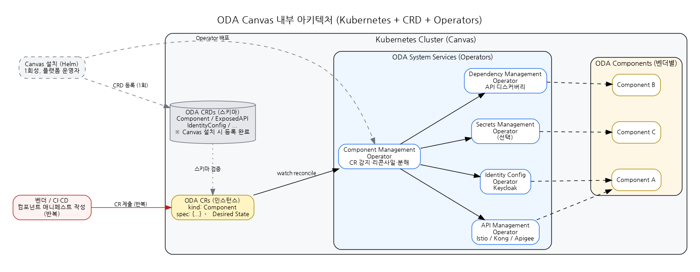
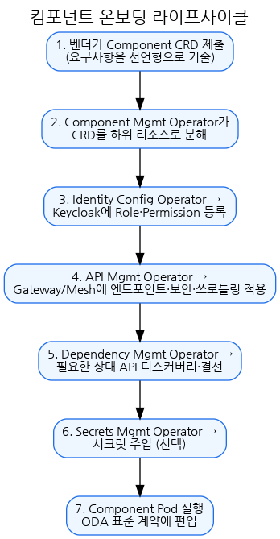
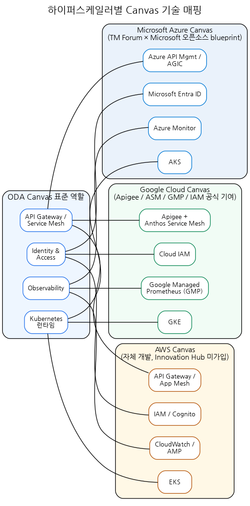

# TM Forum ODA Canvas 세미나 자료

## 1. 정의

**ODA Canvas = ODA Components를 실행하는 표준화된 클라우드 네이티브 실행 환경(Execution Environment).**

쿠버네티스 위에 "ODA 시스템 서비스" 세트를 얹어, ODA Components가 어떤 벤더의 것이든 **plug-and-play** 로 배포·운영될 수 있도록 만든 런타임 레이어입니다.

---

## 2. 왜 Canvas가 필요한가

통신사 IT가 벤더별 모놀리식 스택에 묶여 있는 한, Components 표준(eTOM/SID/TAM/Open APIs)만으로는 실제 배포·운영 현장의 파편화를 해결하지 못합니다.

**Canvas가 해결하는 문제**

- **다벤더 온보딩**: 벤더마다 다른 배포 방식, 인증 연동, API 노출 방식을 표준 계약으로 통일
- **라이프사이클 관리 자동화**: 컴포넌트 배포/업데이트/종료를 Kubernetes Operator로 자동화
- **비기능 요건의 공통화**: 인증, 시크릿, API 게이트웨이, 의존성 탐색을 Canvas가 일괄 제공

---

## 3. ODA 내 Canvas의 위치

이전 세션의 ODA 설명을 빠르게 연결만 하면:

- **Components**: 표준화된 소프트웨어 빌딩 블록 (예: Product Catalog, Customer Management 등)
- **Open APIs**: Components가 노출하는 표준 REST API 계약
- **Canvas**: 위 Components들이 **실제로 돌아가는 표준 런타임**

즉 **"무엇을 만드는가"(Components) + "어떻게 말하는가"(Open APIs) + "어디서 돌리는가"(Canvas)** 의 삼각 구도에서 Canvas가 마지막 꼭짓점을 담당합니다.

### 그림 1. ODA 삼각 구도 속 Canvas



---

## 3.5 잠깐, Kubernetes Operator 패턴이란? (Canvas 이해를 위한 공통 개념)

Canvas의 핵심 메커니즘이 **Kubernetes Operator**이므로, Canvas 아키텍처로 들어가기 전에 이 개념을 간단히 정리합니다.

### 한 문장 정의
**Operator = "인간 운영자가 손으로 하던 일"을 쿠버네티스 안에서 자동으로 수행하도록 만든 커스텀 컨트롤러.**
> 쿠버네티스에서 제공하는 리소스 이외에 사용자가 새롭게 정의한 리소스를 관리해주는 패턴

### 그림 2. Kubernetes Operator 패턴



### 구성요소 (3가지)

- **CRD (Custom Resource Definition)**
  쿠버네티스에 "이런 모양의 새로운 리소스 타입이 있다"고 스키마를 등록. 예: `kind: Component`, `kind: MyDatabase`.

  https://github.com/tmforum-oda/oda-canvas/tree/main/charts/oda-crds/templates

  ```yaml
  apiVersion: apiextensions.k8s.io/v1
  kind: CustomResourceDefinition
  metadata:
    name: components.oda.tmforum.org          # <plural>.<group>
  spec:
    group: oda.tmforum.org
    scope: Namespaced
    names:
      kind: Component
      plural: components
      singular: component
      shortNames: [odac]
    versions:
      - name: v1
        served: true
        storage: true
        schema:
          openAPIV3Schema:
            type: object
            properties:
              spec:
                type: object
                properties:
                  type:        { type: string }   # 예: ProductCatalogManagement
                  version:     { type: string }
                  description: { type: string }
                  coreFunction:
                    type: object
                    properties:
                      exposedAPIs:
                        type: array
                        items:
                          type: object
                          properties:
                            name:          { type: string }
                            specification: { type: string }   # TMF API 명세 URL/ID
                            implementation:{ type: string }   # 내부 서비스 이름
                            path:          { type: string }
                            port:          { type: integer }
                      dependentAPIs:
                        type: array
                        items:
                          type: object
                          properties:
                            name:          { type: string }
                            specification: { type: string }
                  securityFunction:
                    type: object
                    properties:
                      controllerRole: { type: string }
              status:
                type: object
                x-kubernetes-preserve-unknown-fields: true
        subresources:
          status: {}
  ```

- **CR (Custom Resource)**
  사용자가 실제로 제출하는 YAML 인스턴스. **Desired State(원하는 상태)** 만 선언합니다. 예: "Postgres 레플리카 3개, 백업 매일 2시".

  https://github.com/tmforum-oda/oda-canvas/tree/main/feature-definition-and-test-kit/testData/productcatalog-dependendent-API-v1beta4


  ```yaml
  apiVersion: oda.tmforum.org/v1
  kind: Component
  metadata:
    name: acme-productcatalog
    labels:
      oda.tmforum.org/componentName: acme-productcatalog
  spec:
    type: ProductCatalogManagement
    version: "1.2.0"
    description: "ACME 사의 Product Catalog 컴포넌트"

    coreFunction:
      # 이 컴포넌트가 외부에 노출할 TMF API
      exposedAPIs:
        - name: productcatalog
          specification: "TMF620 Product Catalog Management v4.0"
          implementation: acme-productcatalog-svc   # k8s Service 이름
          path: /tmf-api/productCatalogManagement/v4
          port: 8080

      # 이 컴포넌트가 필요로 하는 타 TMF API (의존성)
      dependentAPIs:
        - name: partyManagement
          specification: "TMF632 Party Management v4.0"

    securityFunction:
      controllerRole: ProductCatalogAdmin
  ```

- **Controller (= Operator 본체)**
  CR을 **Watch**하면서 실제 상태(Actual State)와 비교(**Diff**)하고, 차이가 있으면 실제 리소스를 생성/수정(**Reconcile**)해 원하는 상태로 맞추는 루프를 무한히 반복합니다.

  https://github.com/tmforum-oda/oda-canvas/blob/main/source/operators/TMFOP001-Component-Management/component-management/componentOperator.py

  ```python
  import kopf
  
  @kopf.on.create('oda.tmforum.org', 'v1', 'components')
  @kopf.on.update('oda.tmforum.org', 'v1', 'components')
  def reconcile_component(spec, name, namespace, **_):
    # spec 읽어서 ExposedAPI, IdentityConfig 등 하위 CR을 생성/갱신
    for api in spec.get('coreFunction', {}).get('exposedAPIs', []):
        create_or_update_exposed_api(name, namespace, api)
  ```

> 비유: **"YAML에 '나는 이런 DB가 필요해' 라고 쓰면, 로봇 DBA가 Deployment·Service·Secret·백업 CronJob까지 알아서 만든다."**

## 번외: Component 배포 구조 (Helm)
```
my-component/
├── Chart.yaml
├── values.yaml                 # 파라미터 (이미지, 레플리카, 도메인 등)
└── templates/
    ├── component.yaml          # ODA Component CR (Helm 템플릿)
    ├── deployment.yaml         # 실제 워크로드 Deployment
    ├── service.yaml            # 워크로드 Service
    └── _helpers.tpl
```

### 왜 ODA Canvas가 이 패턴을 채택했나
- **선언형**: 통신사 컴포넌트 벤더는 복잡한 배포 절차 대신 **Component CR 한 장만 제출**하면 됨
- **자동화**: Canvas의 Operator들이 나머지(Gateway, Identity, Secret, Observability) 구성을 **자기 책임 하에** 자동으로 맞춰 구성
- **확장성**: 기존 Istio/Kong/Keycloak 같은 업계 표준 Operator를 Canvas에 그대로 연동 가능

공식 원문:
> *"The Reference Implementation implements operators following the **Kubernetes Operator Pattern**."*
> — TM Forum, `tmforum-oda/oda-canvas` GitHub

### ODA Canvas 문맥
- Canvas 설치 = ODA CRD(Component, ExposedAPI, IdentityConfig...), Operator Deployment, Keycloak/Istio(기반 인프라) 등이 등록됨
- 벤더가 제품 배포 = Component CR 한 장을 클러스터에 제출
- Canvas Operator들이 그 CR을 받아 체인으로 처리

### 참고 (공식 문서)
- Kubernetes.io, *Operator pattern*: https://kubernetes.io/docs/concepts/extend-kubernetes/operator/
- Kubernetes.io, *Custom Resources*: https://kubernetes.io/docs/concepts/extend-kubernetes/api-extension/custom-resources/

---

## 4. 핵심 아키텍처

### 4.1 기술 기반

- **Kubernetes**를 기반으로 함
- 쿠버네티스의 **CRD(Custom Resource Definitions)** 로 ODA 전용 리소스 타입을 정의
- 이 CRD들을 처리하는 **Operator**들이 Canvas의 ODA 시스템 서비스 역할을 수행
- Reference Implementation은 **100% 오픈소스**, 쿠버네티스 외에는 **기술 중립적(technology agnostic)** 으로 설계

출처: TM Forum ODA Canvas 공식 페이지, GitHub `tmforum-oda/oda-canvas` 리포지토리.

### 4.2 배포 모델

- Canvas는 **다운로드하여 로컬에 직접 배포 가능**한 오픈소스 레퍼런스 구현 형태로 제공
- 간단한 UI를 포함하여 쿠버네티스 숙련자가 아니어도 시작할 수 있도록 설계
- CSP들은 이 Reference Canvas를 베이스로 **자사 Canvas**를 구축하거나, **하이퍼스케일러 제공 Canvas**를 채택 가능

### 4.3 설치 방법 (Helm Chart 구성)

Canvas Reference Implementation은 **Helm chart 묶음**으로 제공되며, 공식 가이드는 `tmforum-oda/oda-canvas` 레포의 [`installation/README.md`](https://github.com/tmforum-oda/oda-canvas/blob/main/installation/README.md)에 정리.

#### 전제 조건 (사전에 준비)

| 항목 | 버전·조건 | 비고 |
|---|---|---|
| Kubernetes | 1.22 ~ 1.30 | ODA Component 버전별 호환성 표 참조 (CRD v1 기준 1.30까지) |
| Helm | 3.0 이상 | `helm-resolve-deps` 플러그인 권장 |
| Istio | 최신 | `istio-base` + `istiod` + `istio-ingress` 를 먼저 설치 |

> APISIX나 Kong을 게이트웨이로 선택할 경우 Istio 대신 해당 게이트웨이를 먼저 준비.

#### `canvas-oda` 차트에 번들된 것들

차트 한 번 설치로 아래가 `canvas` 네임스페이스에 한꺼번에 올라옵니다.

- **ODA CRDs**: `components` / `exposedapis` / `identityconfigs` / `dependentapis` / `publishednotifications` 등
- **메인 컨트롤러**: `oda-controller` Deployment (Component·API·Identity·Dependency Operator가 함께 탑재)
- **버전 변환**: `compcrdwebhook` (Component CR의 버전 간 변환 웹훅)
   - Component CRD는 v1/v1beta4/v1beta3/v1beta2 4개 버전을 동시 서빙
   - 저장 버전(v1)과 다른 버전으로 요청이 오면 이 웹훅이 변환 처리
- **IAM 스택**: `canvas-keycloak` + `canvas-postgresql` StatefulSet, `keycloak-config-cli` Job (Realm 초기화)
- **설치 후 초기화**: `job-hook-postinstall`
- **게이트웨이 Operator** (values에서 택일): `api-operator-istio`(기본) / `apisix-gateway-install` / `kong-gateway-install`
- **선택**: `canvas-vault` (HashiCorp Vault, 기본 활성. Secrets Management 쓸 때 필요)

#### 설치 명령

```bash
# 1. 공식 Helm 리포지토리 추가
helm repo add oda-canvas https://tmforum-oda.github.io/oda-canvas
helm repo update

# 2. 기본 설치 (Istio 게이트웨이, Vault 포함)
helm install canvas oda-canvas/canvas-oda \
  -n canvas --create-namespace
```

**다른 게이트웨이를 쓰고 싶다면** (예: APISIX)

```bash
helm install canvas oda-canvas/canvas-oda \
  -n canvas --create-namespace \
  --set api-operator-istio.enabled=false \
  --set apisix-gateway-install.enabled=true \
  --set kong-gateway-install.enabled=false
```

**Vault 없이 설치**하고 싶다면

```bash
helm install canvas oda-canvas/canvas-oda \
  -n canvas --create-namespace \
  --set canvas-vault.enabled=false
```

#### 설치 후 확인

```bash
kubectl get pods -n canvas
```

정상 설치 시 예상되는 Pod 구성:

```
NAME                       READY   STATUS
canvas-keycloak-0          1/1     Running
canvas-postgresql-0        1/1     Running
compcrdwebhook-xxx         1/1     Running
oda-controller-xxx         2/2     Running
job-hook-postinstall-xxx   0/1     Completed
```

Canvas가 제공하는 CRD 버전 확인:

```bash
kubectl get crd components.oda.tmforum.org \
  -o jsonpath='{.spec.versions[?(@.served==true)].name}'
```

출처: GitHub `tmforum-oda/oda-canvas`, `installation/README.md`.

---

## 5. Canvas를 구성하는 Operator (핵심 구성요소)

> Canvas의 Operator는 **"운영자의 지식을 코드화한 컨트롤 루프"**입니다. CR에 선언된 상태와 실제 인프라 상태를 끊임없이 비교(reconcile)해 **둘이 어긋나지 않도록 계속 맞추는 것**이 본질이에요. 리소스 생성은 그 과정에서 일어나는 결과일 뿐 목적이 아닙니다.
>
> **참고**: Canvas Operator는 앱의 Deployment/Service 같은 기본 워크로드를 **직접 만들지 않습니다.** 그건 벤더 Helm chart의 몫이에요. Canvas는 그 위에 **ODA 표준 준수를 위한 정책·설정**이 항상 스펙대로 유지되도록 보장합니다.
>
> Canvas는 **모듈형 아키텍처**라서 아래 Operator들은 조합·교체 가능합니다. 각 Operator의 **상세 리소스 매핑은 부록 A** 참고.

### 5.1 Component Management Operator
- **책임**: 컴포넌트 전체 라이프사이클을 오케스트레이션 (탑재·갱신·제거 전반)
- **동작**: Component CR을 watch → spec을 하위 CR로 분해해 전용 Operator에게 위임 → 진행 상태를 Component CR의 `status`에 집계
- **구체 예시**:
  - Component CR에 `coreFunction.exposedAPIs: [...]`가 있으면 → 각 API마다 **`ExposedAPI` CR을 생성**
  - `dependentAPIs`, `securityFunction`, `secretsManagement` 블록도 각각 **`DependentAPI` / `IdentityConfig` / `SecretsManagement` CR로 분해**
  - Component CR의 `status.deployment_status`를 `In-Progress-IDConfOp` → `Complete`로 단계별 집계
- **관리 리소스**: ExposedAPI / DependentAPI / IdentityConfig / SecretsManagement / PublishedNotification CR
- **출처**: `source/operators/TMFOP001-Component-Management/component-management/componentOperator.py`

### 5.2 API Management Operator
- **책임**: 컴포넌트가 노출하는 API가 **표준 게이트웨이 정책 하에** 외부로 도달하도록 유지
- **동작**: ExposedAPI CR을 watch → Canvas가 선택한 기술(Istio/Kong/Apigee/Azure APIM)의 리소스를 spec과 일치시킴
- **구체 예시 (Istio 변형)**:
  - ExposedAPI CR에 `path: /tmf-api/productCatalogManagement/v4`가 선언되면 → 해당 path를 match 룰로 가진 **Istio `VirtualService` 생성**하여 Istio Ingress Gateway에 연결
  - 동일 hostname·path 충돌 감지 로직으로 중복 라우트 방지
  - ExposedAPI의 `apiType: prometheus`인 경우 → Prometheus Operator의 **`ServiceMonitor` CR까지 생성**해 메트릭 스크레이프 대상으로 등록
- **관리 리소스**: Istio VirtualService, ServiceMonitor (prometheus apiType 한정) / Kong·APISIX·Apigee 각 변형에서는 해당 기술의 CR·정책
- **출처**: `source/operators/TMFOP002-API-Management/istio/apiOperatorIstio.py` (`createOrPatchVirtualService`, L663 ServiceMonitor)



### 5.3 Identity Config Operator
- **책임**: 컴포넌트의 신원·권한 체계가 **IAM 시스템에 정확히 반영**되도록 유지
- **동작**: IdentityConfig CR을 watch → Keycloak Admin API (또는 Entra ID Graph API) 호출로 선언된 상태에 수렴
- **구체 예시 (Keycloak 변형)**:
  - IdentityConfig CR이 생성되면 → Keycloak Admin 토큰 획득 후 **`create_client(name)`**으로 컴포넌트 이름의 Keycloak Client 생성
  - `spec.canvasSystemRole` 값으로 **canvasSystemRole을 Client에 등록**하고 canvassystem client에도 바인딩
  - `spec.componentRole: [{name: pcadmin}, {name: cat1owner}]` 목록을 순회하며 각 role을 **Keycloak Client Role로 `add_role`**
  - 동적 role 모드(`permissionSpecificationSetAPI`): 컴포넌트가 노출한 TMF672 API를 폴링해 Role 목록을 주기 동기화
- **관리 리소스**: Keycloak Client, Role (K8s 리소스는 만들지 않고 Keycloak 서버 상태를 직접 변경)
- **출처**: `source/operators/TMFOP003-Identity-Config/keycloak/identityConfigOperatorKeycloak.py` (L197 create_client, L237 add_role)

### 5.4 Secrets Management Operator (선택)
- **책임**: 컴포넌트가 **볼트에서 비밀값을 안전하게 읽을 수 있는 경로**를 자동으로 마련
- **동작**: **Kopf admission webhook**으로 Pod 생성 요청을 가로채 스펙을 변형 (mutating webhook)
- **구체 예시 (HashiCorp Vault 변형)**:
  - SecretsManagement CR이 걸린 컴포넌트의 Pod이 스케줄되면 → Admission 단계에서 **`smansidecar` 사이드카 컨테이너를 Pod에 주입**
  - 사이드카는 `canvas-vault-hc` 서비스(클러스터 내부 HashiCorp Vault)에 인증해 시크릿을 가져와 **localhost 포트(기본 5000)로 앱 컨테이너에 노출**
  - `smansidecar-tmp`(emptyDir), `smansidecar-kube-api-access` 볼륨도 함께 주입 (K8s Secret을 직접 만들지 않음)
- **관리 리소스**: Pod spec에 사이드카 컨테이너·볼륨 주입, Vault 인증 경로 구성
- **출처**: `source/operators/TMFOP007-Secrets-Management/vault/docker/secretsmanagementOperatorHC.py` (L228 inject_sidecar, L297 container_smansidecar)

### 5.5 Dependency Management Operator
- **책임**: 컴포넌트가 요구하는 **타 컴포넌트 API 의존성**을 런타임에 자동으로 해소
- **동작**: DependentAPI CR을 watch → 클러스터의 ExposedAPI를 **Canvas Service Inventory 서비스**를 통해 조회해 매칭, 결과를 CR status에 기록
- **구체 예시 (simple 레퍼런스 구현)**:
  - DependentAPI CR이 `name: downstreamproductcatalog, specification: TMF620`로 들어오면 → Canvas Service Inventory API를 호출해 매칭되는 ExposedAPI 검색
  - 찾으면 **`svc_info.create_service(url=..., state="active")`**로 Service Inventory에 서비스 레코드 등록
  - DependentAPI CR에 `status.url`과 `status.implementation_Ready: true`를 **`patch_namespaced_custom_object`로 패치** → 앱은 이 CR status에서 URL을 읽어 사용
  - 실제 통신사 환경에서는 이 simple 구현을 자사 API 승인·발급 프로세스에 맞게 교체하는 것이 공식 가이드
- **관리 리소스**: Canvas Service Inventory 레코드, DependentAPI CR의 status 필드
- **출처**: `source/operators/TMFOP005-Dependency-Management/simple-dependency-management/docker/src/dependentApiSimpleOperator.py` (L194 updateServiceInventory, L276 patch_namespaced_custom_object)

출처: TM Forum GitHub `tmforum-oda/oda-canvas`, `Canvas-design.md` 및 Operator 문서.

### 그림 4. Canvas 내부 아키텍처 (Kubernetes + CRD + Operators)



> 공식 도식 원본:
> - TM Forum ODA Canvas Design: https://tmforum-oda.github.io/oda-ca-docs/canvas/Canvas-design.html
> - GitHub `Canvas-design.md`: https://github.com/tmforum-oda/oda-canvas/blob/main/Canvas-design.md

---

## 6. 동작 흐름 (컴포넌트가 Canvas에 올라갈 때)

벤더가 배포하는 ODA Component의 라이프사이클을 단계별로 보면 다음과 같습니다.

1. 벤더가 Helm으로 **앱 워크로드(Deployment/Service 등) + Component CR**을 함께 배포
2. **Component Management Operator**가 Component CR을 감지해 하위 CR(ExposedAPI, IdentityConfig 등)로 분해
3. **Identity Config Operator**가 Keycloak에 Client/Role/Permission 등록
4. **API Management Operator**가 Gateway/Service Mesh에 엔드포인트, 보안, 쓰로틀링 정책 적용
5. **Dependency Management Operator**가 필요한 상대 컴포넌트 API를 디스커버리해 연결
6. **Secrets Management Operator**가 필요한 비밀값을 주입
7. 컴포넌트가 **ODA 표준 계약에 편입**되어 정상 서비스 상태로 진입

> 핵심 메시지: **컴포넌트는 "무엇이 필요한지"만 선언하고, Canvas가 "어떻게 제공할지"를 책임집니다.**

### 그림 5. 컴포넌트 온보딩 라이프사이클



---

## 7. 에코시스템과 레퍼런스 구현

### 7.1 공식 레퍼런스
- GitHub: **`tmforum-oda/oda-canvas`** (오픈소스, Kubernetes Operator Pattern 기반)
- 문서: `tmforum-oda.github.io/oda-ca-docs/`
- 포함물: Reference Implementation, Use Cases, **Test Kit**

### 7.2 하이퍼스케일러 Canvas 현황 (2025 기준)
- **Microsoft Azure**: 최초로 오픈소스 **하이퍼스케일러 blueprint** 공개. CSP가 Azure 위에서 carrier-grade Canvas를 빠르게 구축 가능.
- **Google Cloud**: **Apigee**(API 관리), **ASM**(Service Mesh), **Google Managed Prometheus**(관측), **IAM**(Identity)을 Canvas 구성요소로 매핑하여 제공.
- **AWS**: ODA-compliant Canvas 자체 개발 (공식 Innovation Hub 멤버는 아님).
- 추가 하이퍼스케일러들도 자사 Canvas 구현을 오픈소스 기여 형태로 공개 예정.

출처: TM Forum 보도자료, TM Forum Inform, TelecomTV.

### 그림 4. 하이퍼스케일러별 Canvas 기술 매핑



> 주: 공식 발표로 확인된 대응은 **Google의 Apigee / ASM / GMP / IAM**과 **Microsoft의 Azure 오픈소스 blueprint** 입니다. AWS 구성요소는 일반적인 AWS 서비스 매핑 예시이며, AWS가 공식 Innovation Hub 멤버는 아닙니다.

### 7.3 Community Innovation Hub
- TM Forum이 운영하는 협업 공간에서 **통신사, 벤더, 하이퍼스케일러**가 공동으로 레퍼런스 Canvas를 개선.

---

## 8. 참고 자료 (공식 출처)

- TM Forum, *ODA Canvas (Deployment & Runtime)*: https://www.tmforum.org/oda/deployment-runtime/oda-canvas/
- TM Forum, *Components & Canvas*: https://www.tmforum.org/open-digital-architecture/components-canvas/
- TM Forum, *About Open Digital Architecture (ODA)*: https://www.tmforum.org/oda/about/
- TM Forum, *ODA Component Conformance Certification*: https://www.tmforum.org/oda/directory/conformance
- TM Forum Learning, *ODA Canvas Awareness Training*: https://www.tmforum.org/learn/education/oda-canvas-awareness-training/
- TM Forum Inform, *DTW24-Ignite: Telcos and hyperscalers adopt ODA Canvas for plug-and-play interoperability*: https://inform.tmforum.org/features-and-opinion/dtw24-ignite-telcos-and-hyperscalers-adopt-oda-canvas-for-plug-and-play-interoperability
- TM Forum Press Release, *Carrier-Grade Open Source ODA Canvases become a Reality* (TM Forum × Microsoft): https://www.tmforum.org/press-and-news/tm-forum-in-collaboration-with-microsoft-makes-carrier-grade-open-source-oda-canvases-a-reality-for-global-telcos/
- GitHub, *tmforum-oda/oda-canvas* (Reference Implementation): https://github.com/tmforum-oda/oda-canvas
- ODA Canvas Design Docs: https://tmforum-oda.github.io/oda-ca-docs/canvas/Canvas-design.html
- ODA Canvas Operators Docs: https://tmforum-oda.github.io/oda-ca-docs/canvas/source/operators/README.html

---

## 부록 A. Operator별 관리 리소스 상세 매핑

> 본문 섹션 5의 "관리 리소스 예시"를 실무자용으로 풀어쓴 참조 표입니다. Canvas를 특정 기술 스택 위에 배포할 때 **어떤 리소스가 어떤 Operator의 책임 하에 유지되는지** 빠르게 확인하는 용도입니다. 리소스는 Operator의 결과물이지 목적이 아니라는 점을 기억하세요.

### A.1 API Management Operator

| 대상 | 리소스 | 용도 |
|---|---|---|
| Istio | `VirtualService`, `Gateway`, `DestinationRule`, `AuthorizationPolicy` | 라우팅·TLS·AuthZ 정책 |
| Kong | `KongIngress`, `KongRoute`, `KongPlugin` (rate-limit, JWT, CORS) | 게이트웨이 라우팅·플러그인 |
| Apigee | `Proxy`, `Product`, `API Key` | 외부 파트너 API 상품화 |
| **Azure** | **Azure API Management**의 `API`·`Product`·`Subscription`·`Policy`(XML) | APIM 인스턴스에 TMF API 등록 |
| **Azure** | **AGIC** (Application Gateway Ingress Controller)의 `Ingress` | AKS → Azure Application Gateway 라우팅 |

### A.2 Identity Config Operator

| 대상 | 리소스 | 용도 |
|---|---|---|
| Keycloak | Realm `Client`, `Client Role`, `Client Scope`, `Protocol Mapper` | 컴포넌트 전용 OAuth2 Client 등록 |
| K8s | `Secret` (client_id, client_secret) | 앱 Pod에 주입 |
| **Azure** | **Microsoft Entra ID** `App Registration`, `App Role`, `Service Principal` | Azure AD에 컴포넌트 등록 |
| **Azure** | **Entra ID** `Client Secret` 또는 **Managed Identity**의 `Federated Credential` | 시크릿리스 워크로드 ID 연동 |

### A.3 Secrets Management Operator

| 대상 | 리소스 | 용도 |
|---|---|---|
| External Secrets | `ExternalSecret`, `SecretStore`/`ClusterSecretStore` | Vault·KV → K8s `Secret` 동기화 |
| K8s | `Secret` (리콘사일 결과물) | Pod 환경변수·볼륨 마운트 |
| **Azure** | **Azure Key Vault** `Secret`, CSI Driver `SecretProviderClass` | AKS Pod이 Key Vault 시크릿을 파일로 마운트 |
| **Azure** | **User-Assigned Managed Identity** + Key Vault `Access Policy`/`RBAC` | 시크릿리스 접근 권한 부여 |

### A.4 Dependency Management Operator

| 대상 | 리소스 | 용도 |
|---|---|---|
| K8s | `ConfigMap` (의존 API endpoint 매핑) | 앱이 읽어 upstream URL로 사용 |
| K8s | `DependentAPI` CR의 `status` (Resolved/Unresolved) | GitOps 검증 신호 |
| Istio | `ServiceEntry` | 클러스터 외부 TMF API를 메시에 편입 |
| **Azure** | **Azure API Management** `Backend`, `Named Value` | 의존 API를 APIM 백엔드로 등록 |

### A.5 Observability 연계

| 대상 | 리소스 | 용도 |
|---|---|---|
| kube-prometheus-stack | `ServiceMonitor`, `PodMonitor`, `PrometheusRule` | 메트릭 수집·알림 규칙 |
| OpenTelemetry | `OpenTelemetryCollector`, `Instrumentation` CR | 트레이스 수집 자동 주입 |
| **Azure** | **Azure Monitor** `DataCollectionRule`(DCR), `DataCollectionEndpoint` | AKS 로그/메트릭을 Log Analytics로 전송 |
| **Azure** | **Container Insights** 설정, **Managed Prometheus**의 `Scrape Config` | AMW(Azure Monitor Workspace)로 메트릭 푸시 |

> Azure 리소스 매핑은 TM Forum × Microsoft, *Carrier-Grade Open Source ODA Canvases* 보도자료 및 Azure 공식 문서를 참고한 실무 예시입니다.
